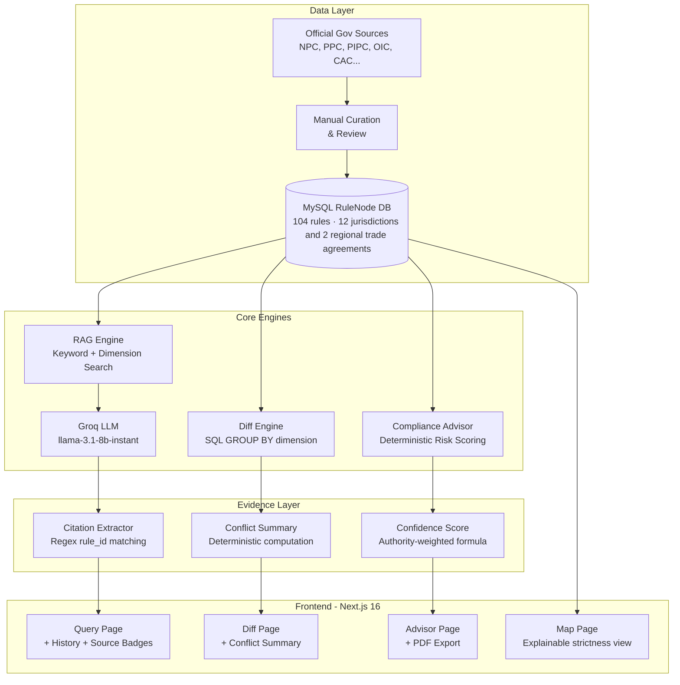

# ReguLink Asia

**Asia-Pacific Digital Trade Compliance Infrastructure**

*104 rules, manually curated from primary sources — quality over quantity.*

> Asia-Pacific Digital Trade Compliance Infrastructure — grounded outputs with verified citations by design. Every claim traceable to official legal text.

🔗 **Live Demo**: [https://regulink.tinystrack.com](https://regulink.tinystrack.com)  
📋 **Built for**: [UNESCAP Global AI Hackathon on Digital Trade Regulatory Analysis 2026](https://www.unescap.org/events/2026/global-hackathon-using-ai-digital-trade-regulatory-analysis)  
📄 **License**: Apache License 2.0

---

## The Problem

Asia-Pacific digital trade regulations are fragmented across 12 jurisdictions and 2 regional trade agreements, frequently updated, and often misunderstood by SMEs and policymakers alike. Existing tools either:
- Use black-box AI that hallucinates legal text without citations
- Require expensive legal consultants for basic compliance questions
- Provide no machine-verifiable evidence trail

**ReguLink Asia solves this by making regulations queryable with verified citations — every output traceable to the exact legal article and official government source.**

---

## Solution

ReguLink Asia is an open-source RAG (Retrieval-Augmented Generation) system with four modules:

| Module | Description | Evidence Method |
|--------|-------------|-----------------|
| **Evidence-Based Query** | Natural language Q&A on APAC regulations | RAG retrieval + citation tags in every response |
| **Regulatory Diff Engine** | Side-by-side comparison across 10 dimensions | ...
| **Compliance Advisor** | Transfer scenario analysis with risk level | Deterministic rule counting + AI summary |
| **Explainable Map** | Visual data governance strictness overview | Structured data from RuleNode database |

---

## Architecture



### Anti-Hallucination Design

The LLM is **only permitted to synthesise from context provided at query time**. It cannot introduce external knowledge.

```
System prompt: "Only use information from the provided context.
If the answer is not in the context, respond:
'No rule found in current database for this query.'"
```

Every factual sentence must end with `[rule_id]`. Post-processing strips untagged sentences.

### Confidence Score Formula

```
confidence = (authority_score × 0.6) + (coverage_score × 0.35) + mandatory_bonus
```

Where:
- `authority_score` = average of `official_law(1.0) > amendment(0.9) > guideline(0.7) > paraphrase(0.5)`
- `coverage_score` = `min(rules_retrieved / 5, 1.0)`
- `mandatory_bonus` = `0.05` if any mandatory rule is present

**Fully deterministic — no AI involvement in score computation.**

---

## Data Coverage

### Asia-Pacific Data Governance Database

ReguLink Asia covers **12 Asia-Pacific jurisdictions** with full data protection law texts, plus **2 regional trade agreements** (RCEP and CPTPP) cross-referenced as context for cross-border commerce rules.

#### Jurisdictions (12)

| Code | Jurisdiction | Primary Law | Effective Date | Source Authority |
|------|--------------|-------------|----------------|------------------|
| CN | China | PIPL + DSL + CBDT 2024 | 2021-11-01 | Official Law |
| JP | Japan | APPI 2022 Amendment | 2022-04-01 | Official Law |
| KR | South Korea | PIPA 2023 Amendment | 2023-09-15 | Official Law |
| TH | Thailand | PDPA B.E. 2562 | 2022-06-01 | Official Law |
| VN | Vietnam | Decree 13/2023 | 2023-07-01 | Official Law |
| SG | Singapore | PDPA 2021 Amendment | 2021-02-01 | Official Law |
| IN | India | DPDP Act 2023 | 2023-08-11 | Official Law |
| ID | Indonesia | PDP Law No. 27/2022 | 2022-10-17 | Official Law |
| PH | Philippines | Data Privacy Act 2012 | 2012-09-08 | Official Law |
| AU | Australia | Privacy Act 1988 (2022 Amendment) | 2022-12-13 | Official Law |
| MY | Malaysia | PDPA 2010 | 2013-11-15 | Official Law |
| NZ | New Zealand | Privacy Act 2020 | 2020-12-01 | Official Law |

#### Trade Agreement Context (2)

RCEP and CPTPP membership is indicated on each jurisdiction card on the Regulatory Map. The full text of relevant chapters (RCEP Chapter 12 and CPTPP Chapter 14 — both covering Electronic Commerce) is queryable through the citation system.

| Code | Agreement | Relevant Chapter | Effective Date | Source Authority |
|------|-----------|------------------|----------------|------------------|
| RCEP | Regional Comprehensive Economic Partnership | Chapter 12 — Electronic Commerce | 2022-01-01 | Official Treaty |
| CPTPP | Comprehensive and Progressive Agreement for Trans-Pacific Partnership | Chapter 14 — Electronic Commerce | 2018-12-30 | Official Treaty |

### Regulatory Dimensions (10)

`cross_border_transfer` · `data_localisation` · `consent` · `security_assessment` · `breach_notification` · `data_subject_rights` · `retention` · `privacy_policy` · `data_portability` · `algorithmic_decision`
---

## Official Data Sources

All legal texts and treaty documents in our database are sourced from official government publications and intergovernmental treaty repositories.

> **Note on source traceability**
>
> Government legal repositories across Asia-Pacific vary significantly in accessibility — some require HTTP-only access, regional IP restrictions, or are subject to frequent URL restructuring. To ensure long-term reliability, ReguLink Asia preserves the full legal text in our database, indexed by permanent citation IDs (e.g., `CN-PIPL-38`, `TH-PDPA-28`, `RCEP-CH12-9`). Every answer the system returns can be traced back to a specific clause, independent of external URL availability.

| Jurisdiction | Document | Source Authority |
|--------------|----------|------------------|
| China | 个人信息保护法 (PIPL) · 数据安全法 (DSL) · 促进和规范数据跨境流动规定 (CBDT 2024) | National People's Congress (npc.gov.cn) · Cyberspace Administration (cac.gov.cn) |
| Japan | 個人情報保護法 (APPI) 2022 Amendment | Personal Information Protection Commission (ppc.go.jp) |
| South Korea | 개인정보 보호법 (PIPA) 2023 Amendment | Personal Information Protection Commission (pipc.go.kr) |
| Thailand | พ.ร.บ.คุ้มครองข้อมูลส่วนบุคคล (PDPA B.E. 2562) | Office of the Personal Data Protection Committee (pdpc.or.th) |
| Vietnam | Nghị định 13/2023/NĐ-CP | Government Portal (chinhphu.vn) |
| Singapore | Personal Data Protection Act 2012 (2021 Amendment) | Personal Data Protection Commission (pdpc.gov.sg) |
| India | Digital Personal Data Protection Act 2023 | Ministry of Electronics and Information Technology (meity.gov.in) |
| Indonesia | UU No. 27 Tahun 2022 tentang Pelindungan Data Pribadi | National Legislation Database (bpk.go.id) |
| Philippines | Republic Act No. 10173 — Data Privacy Act of 2012 | National Privacy Commission (privacy.gov.ph) |
| Australia | Privacy Act 1988 (Cth) — 2022 Amendment | Federal Register of Legislation (legislation.gov.au) |
| Malaysia | Personal Data Protection Act 2010 | Department of Personal Data Protection (pdp.gov.my) |
| New Zealand | Privacy Act 2020 | New Zealand Legislation (legislation.govt.nz) |
| RCEP | Chapter 12 — Electronic Commerce | RCEP Joint Committee · ASEAN Secretariat (asean.org) |
| CPTPP | Chapter 14 — Electronic Commerce | New Zealand Ministry of Foreign Affairs & Trade (mfat.govt.nz) |

---

## Tech Stack

| Layer | Technology |
|-------|-----------|
| Frontend | Next.js 16 + TypeScript + Tailwind CSS 4 |
| Runtime | Bun 1.3 |
| Database | MySQL 8 (Docker) |
| LLM | Groq API (llama-3.1-8b-instant) via OpenAI-compatible endpoint |
| PDF Export | @react-pdf/renderer |
| Process Manager | PM2 |
| Reverse Proxy | Nginx + Let's Encrypt |

---

## Local Setup

### Prerequisites

- Bun 1.3+
- Docker
- MySQL 8 (via Docker)

### Installation

```bash
# Clone
git clone https://github.com/tinystrack/regulink-asia.git
cd regulink-asia

# Install dependencies
bun install

# Start MySQL
docker run -d \
  --name regulink-mysql \
  -e MYSQL_ROOT_PASSWORD=your_password \
  -e MYSQL_DATABASE=regulink_asia \
  -p 3306:3306 \
  mysql:8

# Configure environment
cp .env.example .env.local
# Edit .env.local with your values

# Seed database
bun run scripts/seed-cn.ts
bun run scripts/seed-jp.ts
bun run scripts/seed-kr.ts
bun run scripts/seed-th.ts
bun run scripts/seed-vn.ts
bun run scripts/seed-sg.ts
bun run scripts/seed-extra.ts  # India, Indonesia, Philippines, Australia, Malaysia, New Zealand, RCEP, CPTPP

# Build and run
bun run build
bun run start
```

### Environment Variables

```bash
DATABASE_HOST=127.0.0.1
DATABASE_PORT=3306
DATABASE_USER=root
DATABASE_PASSWORD=your_password
DATABASE_NAME=regulink_asia

# Groq API (free tier available)
GROQ_API_KEY=your_groq_key
LLM_BASE_URL=https://api.groq.com/openai/v1
OPENROUTER_MODEL=llama-3.1-8b-instant

PORT=3110
NEXT_PUBLIC_APP_URL=https://your-domain.com
```

---

## UN SDG Alignment

| SDG | Goal | How ReguLink Asia Contributes |
|-----|------|-------------------------------|
| **SDG 8** | Decent Work & Economic Growth | Reduces compliance barriers for SMEs engaging in cross-border digital trade across APAC |
| **SDG 9** | Industry, Innovation & Infrastructure | Provides open-source regulatory infrastructure accessible to all — no expensive legal consultants required |
| **SDG 16** | Peace, Justice & Strong Institutions | Every output is traceable to official legal text, enabling transparent, accountable, evidence-based policy analysis |

---


## Methodology

ReguLink Asia follows a structured six-stage pipeline designed to minimise hallucination and maximise evidence traceability.

### Stage 1 — Legal Text Ingestion
Official government publications are manually identified and downloaded from authoritative sources (NPC, PPC Japan, PIPC Korea, OIC Thailand, CAC China, etc.). No live scraping is performed — this ensures source stability, authenticity, and demo reliability.

### Stage 2 — Rule Normalisation
Each document is parsed into discrete **RuleNode** records: one record per article or sub-clause addressing a specific regulatory dimension. Every record is assigned a `source_authority` classification:

```
official_law (1.0) > official_amendment (0.9) > ministry_guideline (0.7) > paraphrase (0.5)
```

This classification is human-assigned and human-reviewed — never inferred by AI.

### Stage 3 — Structured Indexing
RuleNodes are stored in a relational MySQL database with a normalised schema. The `dimension` field enables structured queries across 10 regulatory dimensions. The `requirement_type` field (`mandatory / conditional / voluntary / prohibited / not_regulated`) enables deterministic risk scoring without AI involvement.

### Stage 4 — Query-Time Retrieval
At query time, the system performs keyword extraction and dimension detection, then executes a targeted SQL query filtered by country and dimension. This closed-database retrieval ensures the LLM can only access pre-verified legal text — no open-web access is permitted at inference time.

### Stage 5 — Evidence Grounding
Retrieved RuleNodes are injected verbatim into the LLM context window. The system prompt enforces strict grounding:

> *"Only use information from the provided context. If the answer is not found, respond: No rule found in current database."*

Every factual sentence must end with a `[rule_id]` citation tag. Post-processing extracts these tags and links them to their source RuleNode records.

### Stage 6 — Structured Output Generation
Outputs are structured into three formats depending on the module:
- **Query**: Natural language answer + inline citation pills + source sidebar
- **Diff Engine**: Structured table with per-dimension comparison (pure SQL — zero LLM involvement)
- **Compliance Advisor**: Risk level (HIGH/MEDIUM/LOW) + mandatory steps + PDF report

Risk levels are computed deterministically from `requirement_type` counts in the database. Confidence scores are computed from source authority weights — both fully auditable and reproducible.

---

## Key Design Decisions

**Why RAG over direct LLM prompting?**  
Direct prompting hallucinates. RAG retrieves from a closed, curated database — the LLM only synthesises from verified context.

**Why no web scraping?**  
Scraping introduces instability and copyright risk. Pre-processed, human-reviewed data ensures source accuracy and demo reliability.

**Why deterministic risk scoring?**  
AI-generated risk scores are unverifiable. Our formula uses `requirement_type` counts from the database — transparent, reproducible, auditable.

**Why structured RuleNode schema over free-text storage?**  
Structured data enables the Diff Engine to perform pure SQL comparisons without AI involvement — the most defensible approach for regulatory analysis.

---

## Project Structure

```
regulink-asia/
├── app/
│   ├── api/
│   │   ├── query/route.ts      # RAG engine + confidence scoring
│   │   ├── diff/route.ts       # Diff engine (pure SQL)
│   │   └── advisor/route.ts    # Compliance advisor
│   ├── components/
│   │   ├── Nav.tsx
│   │   ├── CitationSidebar.tsx # Source reliability badges
│   │   └── ExportPDF.tsx       # PDF report generation
│   ├── query/page.tsx          # Query + history + confidence
│   ├── diff/page.tsx           # Diff table + conflict summary
│   ├── advisor/page.tsx        # Compliance advisor + PDF export
│   └── map/page.tsx            # Explainable map
├── lib/
│   ├── db.ts                   # MySQL connection pool
│   ├── types.ts                # RuleNode, Citation, DiffRow types
│   └── prompt.ts               # RAG system prompt
└── scripts/
    ├── seed-cn.ts              # China PIPL + DSL + CBDT
    ├── seed-jp.ts              # Japan APPI 2022
    ├── seed-kr.ts              # Korea PIPA 2023
    ├── seed-th.ts              # Thailand PDPA
    ├── seed-vn.ts              # Vietnam Decree 13
    ├── seed-sg.ts              # Singapore PDPA 2021
    └── └── seed-extra.ts       # India + Indonesia + Philippines + Australia + Malaysia + New Zealand + RCEP + CPTPP
```

---

*Built with ❤️ for UNESCAP AI Hackathon 2026 · Open Source · Apache License 2.0*
